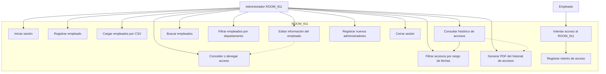
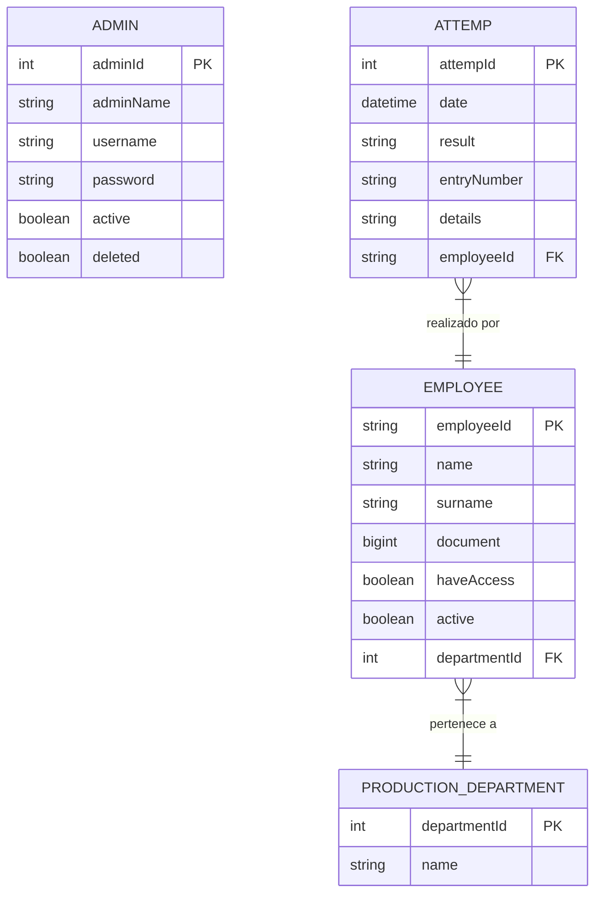

# ROOM_911

Módulo de control de acceso ROOM_911 – Historias de Usuario

**Objetivo general:**  
Diseñar y desarrollar un módulo web que permita gestionar el acceso del personal autorizado al cuarto ROOM_911, mediante autenticación, control de permisos, registro de accesos y generación de reportes.

---

## Actores

- **Administrador ROOM_911**
- **Empleado**

---

## Historias de Usuario

### Administrador ROOM_911
- Iniciar sesión con usuario y contraseña.  
- Registrar nuevos empleados con datos básicos y asignar departamento.  
- Cargar un archivo CSV con varios empleados.  
- Editar información de un empleado y conceder/denegar acceso.  
- Consultar empleados por ID, nombre o apellido.  
- Filtrar empleados por departamento.  
- Consultar histórico de intentos de acceso de un empleado.  
- Filtrar intentos de acceso por rango de fechas.  
- Descargar en PDF el historial de intentos de acceso de un empleado.  
- Registrar y gestionar otros usuarios administradores.

### Empleado
- Simular intento de acceso al ROOM_911 con número de identificación interno.  

---

## Diagramas

## Casos de Uso - ROOM_911

## Modelo Relacional - ROOM_911

Versión: 1.0
Autor: Andres Ramirez
Fecha: 10/05/2025
